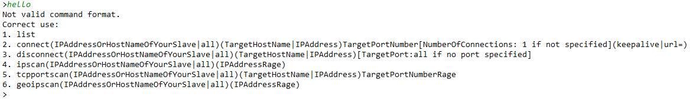
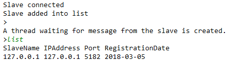
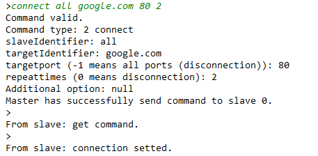
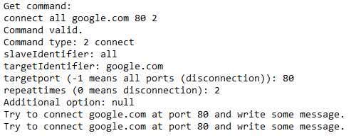
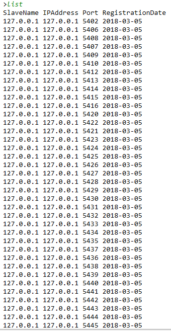

# Java Master Slave Application

This project is create by Yu Shu mainly for record purpose of CMPE206.

## Updates on 3-5-2018

Reorganized codes to fit Intellij IDE. 
I used Eclipse and shell for developing this project before.

More modifications of codes may be later.

## Introduction

The masterbot and slavebots are all implemented by Java multithreading technique. And they can run at different machines.

Masterbot have only one thread to accept connection request from slavebots. For each slavebot, masterbot has one thread to send 
command and one thread to receive message (ipscan reply, etc.). The main thread also holds a list of currently connected thread.

Slavebot is also multithreaded. It can communicate with masterbot, as well as connect to multiple other servers, such as a website server.

## Sample usage

- Master's commands



- A slave connected



- Master's control



- Slave's behavior after getting command



### Interesting test

Master ask a slave to connect itself 100,000 times.

The program of master and slave are both stable after that.
But since this runs out of sockets (ports) available. 
For browser, it cannot connect to websites.

Here is part of the list of slave's connections:



### Story
I'd like to share some little stories about this project.

Acutally, this is my second Java program, since the first one is "Hello world!" automatically generated by eclipse.

When I wrote this, I had just transfer my major into computer engineering. 
And at that time I only knew tiny bit about multi-tasking, network communication, sockets, etc.

But anyway, I can proudly say now, "I did it!" On the one hand, I even don't remember how could I do it (seems people tend to forget unhappy experiences). One the other hand, completion of this project really improves my confidence a lot in computer world, especially programming.

What I learned is: don't hesitate; don't worry; don't say "I can't"; but sit down, read books and documents, and write codes.

### Compile:
Go to the source folder "masterslave".

Run ```make``` in terminal.

### Example:

Run: (go up a folder first)

```bash
java masterslave.masterbot -p 6000

java masterslave.slavebot -p 6000 -h localhost
```

Tested with following command at master side:

```bash
// list all available slaves.
list

// let all slaves connect to www.sjsu.edu, each slave creats 1 connection.
connect all www.sjsu.edu 80 

// let all slaves connect to www.sjsu.edu, each slave creats 2 connection.
connect all www.sjsu.edu 80 2 

// let all slaves disconnect with www.sjsu.edu with port 80
disconnect all www.sjsu.edu 80 

// let all slaves disconnect with www.sjsu.edu with all ports
disconnect all www.sjsu.edu 

// add keepalive option
connect all www.sjsu.edu 80 keepalive 

// creat random strings and let google search, drop all replies
connect all www.google.com 80 2 url=/#q= 

// let all slaves test a range of IPs (by using ICMP echo)
ipscan all 4.2.2.2-4.2.2.8 

// let specific slaves test a range of IPs (by using ICMP echo)
ipscan 127.0.0.1 4.2.2.2-4.2.2.8 

// let specific slaves (chose by name) test a range of IPs (by using ICMP echo)
ipscan localhost 4.2.2.2-4.2.2.8 

// let specific slaves (chose by name) test a range of TCP ports
tcpportscan localhost www.sjsu.edu 79-81 

// let all slaves (chose by name) test a range of TCP ports
tcpportscan all www.sjsu.edu 79-81 

// test geological information, similar formats as before
geoipscan all 4.2.2.2-4.2.2.8 

geoipscan localhost 4.2.2.2-4.2.2.8

geoipscan 127.0.0.1 208.80.153.203-208.80.153.205 
```

### Version 4.0

geoipscan 127.0.0.1 208.80.153.203-208.80.153.205
// ip of wikipedia

### Version 3.0

Add ip scan and tcp port scan feature for a range of IPs.

### Version 2.0

Add keepalive, random postfixes for DDoS attack.

### Version 1.0

connect slave target port repeats

disconnect slave target port
